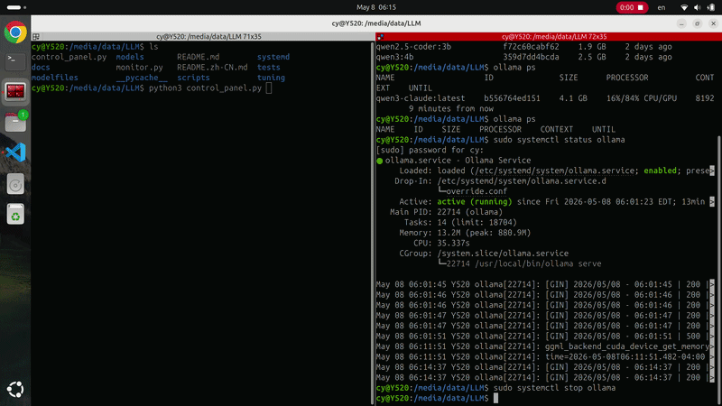

# local-llm-agent

English | [简体中文](README.zh-CN.md)

Locally deployable LLM agent workspace — run models on your own hardware and
plug them into agent workflows. Supports flexible deployment options: native
host or portable drive. Full control, private, and no token limits.

## Deployment Options

| Mode | Use it when | Start command |
|---|---|---|
| Native host | The model store and services live on this computer | `./scripts/ollama/serve.sh` |
| Portable drive | The repo and model store move between computers | `llm-portable` or `./scripts/ollama/llm-portable.sh` |

## Quick Start

```bash
./scripts/setup/check-prereqs.sh       # verify dependencies
./scripts/setup/configure-ollama.sh    # set up Ollama (first time only)

python3 control_panel.py               # browser UI  →  http://localhost:8766
# — or —
./scripts/ollama/serve.sh && ollama run qwen3:4b
```

## Portable Drive

Portable support is optional. Use it when this repo is on a portable drive and
the host may already have Ollama running on `11434`. `llm-portable` starts a
foreground Ollama server with the portable model store on `127.0.0.1:14514`.
`llm-ollama` runs Ollama CLI commands against that portable server without
typing `OLLAMA_HOST=...` every time.

Native host setups can keep using `./scripts/ollama/serve.sh`.

```bash
cd /path/to/portable-drive/local-llm-agent

# Optional: copy the host's Ollama binary onto the drive.
# This does not start Ollama.
./scripts/ollama/install-portable-llm-binary.sh

# Install the short shell commands once.
./scripts/setup/install-llm-portable-command.sh
source ~/.bashrc

# Start the portable Ollama server on 127.0.0.1:14514.
llm-portable
```

Or run the wrapper directly:

```bash
./scripts/ollama/llm-portable.sh
```

In another terminal:

```bash
llm-ollama list
llm-ollama run qwen3:4b
```

Script roles:

| Script | What it does |
|---|---|
| `install-portable-llm-binary.sh` | Copies an Ollama executable to the drive; does not start Ollama |
| `install-llm-portable-command.sh` | Adds `llm-portable` and `llm-ollama` shell commands to `~/.bashrc` |
| `llm-portable.sh` / `llm-portable` | Starts the portable Ollama server on `127.0.0.1:14514` |
| `llm-ollama.sh` / `llm-ollama` | Runs Ollama CLI commands against the portable server |

Full guide: [`docs/portable-llm-launcher.md`](docs/portable-llm-launcher.md)

## Dashboard

Single-file Python dashboards — nothing beyond stdlib.

### Control Panel

Full service and model controls at `http://localhost:8766`.

```bash
python3 control_panel.py
```



### Monitor

Read-only status view at `http://localhost:8765` — safe to expose on shared machines.

```bash
python3 monitor.py
```

Full guide: [`docs/control-panel.md`](docs/control-panel.md)

## Agents

### Cline

Connect to llama.cpp for direct GGUF control:

| Field | Value |
|---|---|
| API Provider | `OpenAI Compatible` |
| Base URL | `http://127.0.0.1:8080/v1` |
| API Key | `114514` |
| Model ID / Context | printed by `./scripts/llama-cpp/cline-server.sh` |

Or connect directly to Ollama (`API Provider: Ollama`, Base URL `http://127.0.0.1:11434`).


Full guide: [`docs/cline.md`](docs/cline.md)

### Claude Code

```bash
./scripts/ollama/serve.sh
sudo systemctl start litellm-proxy
claude-local   # model picker — loaded models shown first, marked RUNNING
```


Full guides: [`docs/claude-local.md`](docs/claude-local.md), [`docs/claude-code.md`](docs/claude-code.md), [`docs/claude-proxy.md`](docs/claude-proxy.md)

### Copilot

```bash
./scripts/ollama/serve.sh
ollama pull qwen2.5-coder:7b
```

Then select the local model in VS Code Copilot Chat.


Full guide: [`docs/copilot.md`](docs/copilot.md)

## Layout

```text
<parent>/
  local-llm-agent/   # this repo
    .local/          # local agent runtime state, venvs, and caches
    models/          # shared GGUF files for llama.cpp and Ollama symlinks
  llama-cpp/         # llama.cpp source/build
  Ollama/            # Ollama model store
```

Every path is overridable via env vars. Large model files (GGUF, Ollama blobs) are gitignored. See [`docs/setup.md`](docs/setup.md) for the full env var reference and service setup.

## Docs

| File | What it covers |
|---|---|
| [`docs/setup.md`](docs/setup.md) | Portable layout, env vars, services, setup flow |
| [`docs/control-panel.md`](docs/control-panel.md) | Control panel and monitor — usage, env vars |
| [`docs/hardware-matching.md`](docs/hardware-matching.md) | Hardware tiers → model choices |
| [`docs/portable-llm-launcher.md`](docs/portable-llm-launcher.md) | Portable LLM Launcher for Linux, macOS, and Windows |
| [`docs/usage-llama-cpp.md`](docs/usage-llama-cpp.md) | llama.cpp CLI/server usage |
| [`docs/usage-ollama.md`](docs/usage-ollama.md) | Ollama service and API usage |
| [`docs/cline.md`](docs/cline.md) | Cline integration and troubleshooting |
| [`docs/copilot.md`](docs/copilot.md) | Copilot Chat/CLI with Ollama |
| [`docs/claude-local.md`](docs/claude-local.md) | `claude-local` launcher and model picker |
| [`docs/claude-code.md`](docs/claude-code.md) | Claude Code CLI with Ollama |
| [`docs/claude-proxy.md`](docs/claude-proxy.md) | Local Anthropic proxy internals |
| [`docs/context-memory.md`](docs/context-memory.md) | Context windows, KV cache, persistent memory |
| [`docs/models.md`](docs/models.md) | Model families and what they do |
| [`docs/maintenance.md`](docs/maintenance.md) | Add / remove / audit / update models |
| [`docs/tuning.md`](docs/tuning.md) | Parameters and Modelfile workflow |
