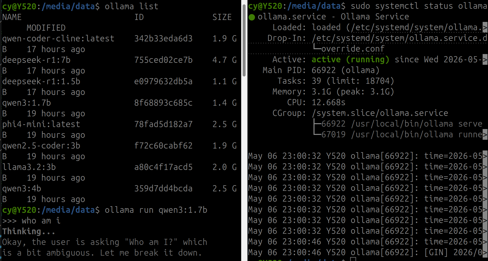
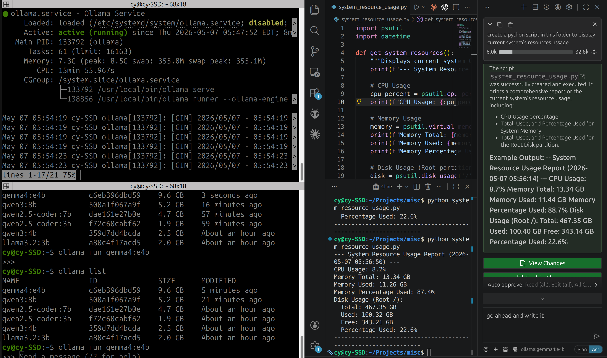

# local-llm-agent

[English](README.md) | 简体中文

`local-llm-agent` 是一套本地 LLM 实验环境，可以自己跑模型，也可以接到 agent 工作流里用。它把 llama.cpp,Ollama、模型文件、Cline/Copilot 配置、服务脚本和调参笔记都放在一起，方便折腾模型和配置，同时不至于把整套配置折腾成黑盒。

默认目录结构是三个同级文件夹：

```text
<parent>/
  local-llm-agent/   # 本仓库
  llama-cpp/         # llama.cpp 源码和构建目录
  Ollama/            # Ollama 模型存储
```

所有路径都可以用环境变量改掉。

## 快速开始

```bash
./scripts/setup/check-prereqs.sh
./scripts/common/show-paths.sh
./scripts/setup/build-llama-cpp.sh
./scripts/ollama/serve.sh
./scripts/llama-cpp/cline-server.sh
```

`scripts/ollama/serve.sh` 会以前台方式启动 Ollama，并把 `OLLAMA_MODELS` 指到这个项目共用的模型目录。直接跑 `ollama serve` 会用 Ollama 默认目录，除非你自己先 export `OLLAMA_MODELS`。

开始之后，可以用 `ollama list` 确认本地模型可见，再用 `ollama run <model>` 在终端里聊天：



如果想装一个手动启动的 `llama-cline` systemd 服务：

```bash
./scripts/setup/install-llama-cline-service.sh
sudo systemctl start llama-cline
```

`llama-cline` 不会开机自启。启动它的时候会先停掉 `ollama.service`，免得两个运行时抢同一块 GPU 显存。

## 硬件与模型匹配

| 示例 | 通用聊天 | 编程 / Cline | 上下文 |
|---|---|---|---:|
| 单板计算机：Raspberry Pi / Orange Pi，8 GB | `llama3.2:1b` | `qwen2.5-coder:0.5b` | 2048 |
| 二手迷你主机：Intel N100/N305，16 GB | `llama3.2:1b` | `qwen2.5-coder:1.5b` | 4096 |
| 小显存 Cline GPU：RTX 3050 笔记本，6 GB VRAM | `qwen3:4b` | `gemma4:e4b`, `qwen2.5-coder:3b` | 4096-8192 |
| 入门 Cline GPU：RTX 3060 12 GB | `qwen3:8b` | `qwen2.5-coder:7b` | 8192-16384 |
| 较强游戏主机：RTX 4080 / 4080 Super | `mistral-nemo:12b` | `qwen2.5-coder:14b` | 16384-32768 |
| 高端单 GPU：RTX 4090 / 5090 | `qwen3:30b`, `gpt-oss:20b` | `qwen2.5-coder:32b`, `qwen3-coder:30b` | 32768+ |
| 大内存 Mac：Mac Studio / MacBook Pro | 7B-32B Q4 模型 | Q4 量化的 `qwen2.5-coder` 系列 | 8192-32768 |

更完整的硬件列表和一些容易踩坑的地方见 [`docs/hardware-matching.md`](docs/hardware-matching.md)。

## 编辑器 / Agent 示例

想直接控制 GGUF 文件和上下文设置，可以让 Cline 连 llama.cpp：

| Cline 字段 | 值 |
|---|---|
| API Provider | `OpenAI Compatible` |
| Base URL | `http://127.0.0.1:8080/v1` |
| API Key | `114514` |
| Model ID | `cline-server.sh` 打印的模型名 |
| Context Window Size | `cline-server.sh` 打印的 `Context` 值 |
| Temperature | `0.2` |
| Max Tokens | `1024` 到 `2048` |

想让 Cline 直接用 Ollama 里已经装好的模型，也可以这样配：

| Cline 字段 | 值 |
|---|---|
| API Provider | `Ollama` |
| Base URL | `http://127.0.0.1:11434` |
| API Key | 如果 Cline 要求填写，用 `114514` |
| Model ID | 已安装的 Ollama 标签，例如 `qwen-coder-cline` |
| Context Window Size | 按模型来，可以先从 `4096` 到 `8192` 开始 |
| Temperature | `0.2` |
| Max Tokens | `1024` 到 `2048` |

连上之后，Cline 可以像这样使用本地 Ollama 模型：



如果存在 `models/qwen2.5-coder-3b.gguf`，llama.cpp 包装脚本会默认用它。

Claude Code 可以通过本地 Anthropic proxy 使用 Ollama。直接运行
`claude-local` 会打开模型选择器；当前 Ollama 已加载的模型会排在最上面并标记为 `RUNNING`：

```bash
./scripts/ollama/serve.sh
sudo systemctl start litellm-proxy
claude-local
```

想让 VS Code 的 Copilot Chat 用本地 Ollama 模型：

```bash
./scripts/ollama/serve.sh
ollama pull qwen2.5-coder:7b
ollama launch vscode
```

然后在 VS Code 的 Copilot Chat 模型选择器里选本地 Ollama 模型。手动配置的话，在 Language Models 里添加 Ollama provider，并把要用的模型显示出来。

Cline 细节见 [`docs/cline.md`](docs/cline.md)，Claude Code + Ollama 见 [`docs/claude-code.md`](docs/claude-code.md)，Copilot + Ollama 见 [`docs/copilot.md`](docs/copilot.md)。

## 路径变量

| 变量 | 默认值 |
|---|---|
| `LOCAL_LLM_AGENT_ROOT` | 本仓库 |
| `LLAMA_CPP_ROOT` | `../llama-cpp` |
| `OLLAMA_ROOT` | `../Ollama` |
| `OLLAMA_MODELS` | `$OLLAMA_ROOT/models/llm` |
| `LLM_MODELS_DIR` | `$LOCAL_LLM_AGENT_ROOT/models` |
| `LLAMA_CPP_BIN` | `$LLAMA_CPP_ROOT/build/bin/llama-cli` |
| `LLAMA_SERVER_BIN` | `$LLAMA_CPP_ROOT/build/bin/llama-server` |
| `SERVICE_USER` | 当前安装用户 |

改路径的例子：

```bash
LLAMA_CPP_ROOT="$HOME/src/llama.cpp" \
OLLAMA_ROOT="$HOME/.ollama-local" \
./scripts/llama-cpp/cline-server.sh
```

## 模型存储

本地 GGUF 文件放这里：

```text
models/
```

大型模型文件已经被 `.gitignore` 忽略。模型目录和安装说明可以写进文档，但别把 GGUF、Ollama blobs、缓存、本机服务状态这些东西提交进去。

Ollama 可以通过 `$OLLAMA_MODELS` 下面的 CAS 符号链接复用这些文件。`scripts/ollama/` 里的脚本负责拉取、导入、重新链接、检查和删除共享模型。

## 常用命令

```bash
./scripts/llama-cpp/llm-list.sh
./scripts/llama-cpp/llm-run.sh qwen3-4b
./scripts/llama-cpp/cline-status.sh
./scripts/ollama/serve.sh
./scripts/ollama/setup-small-models.sh
./scripts/ollama/check-symlinks.sh
sudo systemctl stop llama-cline
sudo systemctl stop ollama
```

## 文档

| 文件 | 内容 |
|---|---|
| [`docs/setup.md`](docs/setup.md) | 可移植目录结构、环境变量、服务和安装流程 |
| [`docs/usage-llama-cpp.md`](docs/usage-llama-cpp.md) | llama.cpp CLI/server 用法 |
| [`docs/usage-ollama.md`](docs/usage-ollama.md) | Ollama 服务和 API 用法 |
| [`docs/cline.md`](docs/cline.md) | Cline 集成和故障排查 |
| [`docs/copilot.md`](docs/copilot.md) | Copilot Chat/CLI 连接 Ollama |
| [`docs/claude-local.md`](docs/claude-local.md) | `claude-local` 启动器、模型选择器和快捷命令 |
| [`docs/claude-code.md`](docs/claude-code.md) | Claude Code 通过本地 Anthropic proxy 连接 Ollama |
| [`docs/claude-proxy.md`](docs/claude-proxy.md) | Claude Code proxy 的工作方式和 guardrail |
| [`docs/context-memory.md`](docs/context-memory.md) | 上下文窗口、KV cache、项目规则和持久记忆 |
| [`docs/models.md`](docs/models.md) | 模型家族是什么、适合做什么 |
| [`docs/hardware-matching.md`](docs/hardware-matching.md) | 按硬件选择模型 |
| [`docs/maintenance.md`](docs/maintenance.md) | 添加、删除、检查、更新和排障任务 |
| [`docs/tuning.md`](docs/tuning.md) | 参数和 personality Modelfile 工作流 |

本机历史记录放在 `.local/worklog.md` 这类被忽略的文件里就好。
