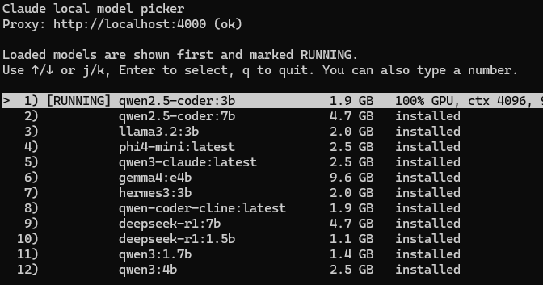
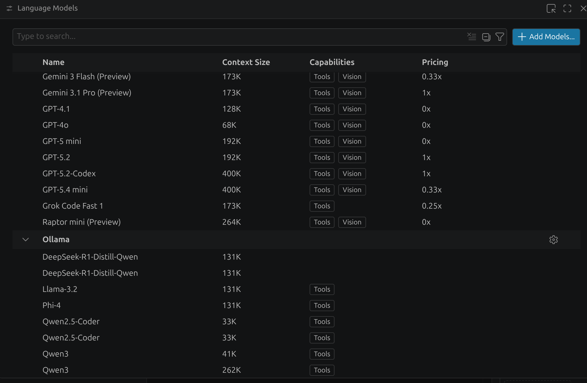

# local-llm-agent

[English](README.md) | 简体中文

本地可部署的 LLM 实验环境——在自己的机器上跑模型，接入 agent 工作流。自主可控，数据留本地，不限 token。

## 快速开始

```bash
./scripts/setup/check-prereqs.sh       # 检查依赖
./scripts/setup/configure-ollama.sh    # 配置 Ollama（仅首次）

python3 control_panel.py               # 浏览器 UI  →  http://localhost:8766
# — 或 —
./scripts/ollama/serve.sh && ollama run qwen3:4b
```

## 控制台

纯 Python stdlib，无需任何依赖。

### 控制面板

完整服务和模型控制，访问 `http://localhost:8766`。

```bash
python3 control_panel.py
```


### 监控面板

只读状态视图，访问 `http://localhost:8765`，适合在共享机器上安全暴露。

```bash
python3 monitor.py
```

完整说明：[`docs/control-panel.md`](docs/control-panel.md)

## Agents

### Cline

连接 llama.cpp，直接控制 GGUF 文件和上下文：

| 字段 | 值 |
|---|---|
| API Provider | `OpenAI Compatible` |
| Base URL | `http://127.0.0.1:8080/v1` |
| API Key | `114514` |
| Model ID / Context | `./scripts/llama-cpp/cline-server.sh` 启动时打印 |

也可以直接连 Ollama（`API Provider: Ollama`，Base URL `http://127.0.0.1:11434`）。


完整说明：[`docs/cline.md`](docs/cline.md)

### Claude Code

```bash
./scripts/ollama/serve.sh
sudo systemctl start litellm-proxy
claude-local   # 模型选择器 — 已加载的模型排在最上面，标记为 RUNNING
```



完整说明：[`docs/claude-local.md`](docs/claude-local.md)、[`docs/claude-code.md`](docs/claude-code.md)、[`docs/claude-proxy.md`](docs/claude-proxy.md)

### Copilot

```bash
./scripts/ollama/serve.sh
ollama pull qwen2.5-coder:7b
```

然后在 VS Code Copilot Chat 的模型选择器里选本地模型。



完整说明：[`docs/copilot.md`](docs/copilot.md)

## 目录结构

```text
<parent>/
  local-llm-agent/   # 本仓库
  llama-cpp/         # llama.cpp 源码和构建目录
  Ollama/            # Ollama 模型存储
```

所有路径均可通过环境变量覆盖。大型模型文件（GGUF、Ollama blobs）已加入 `.gitignore`。完整的环境变量说明和服务配置见 [`docs/setup.md`](docs/setup.md)。

## 文档

| 文件 | 内容 |
|---|---|
| [`docs/setup.md`](docs/setup.md) | 目录结构、环境变量、服务和安装流程 |
| [`docs/control-panel.md`](docs/control-panel.md) | 控制面板与监控面板 — 用法、环境变量 |
| [`docs/hardware-matching.md`](docs/hardware-matching.md) | 按硬件选择模型 |
| [`docs/usage-llama-cpp.md`](docs/usage-llama-cpp.md) | llama.cpp CLI/server 用法 |
| [`docs/usage-ollama.md`](docs/usage-ollama.md) | Ollama 服务和 API 用法 |
| [`docs/cline.md`](docs/cline.md) | Cline 集成和故障排查 |
| [`docs/copilot.md`](docs/copilot.md) | Copilot Chat/CLI 连接 Ollama |
| [`docs/claude-local.md`](docs/claude-local.md) | `claude-local` 启动器和模型选择器 |
| [`docs/claude-code.md`](docs/claude-code.md) | Claude Code 通过本地代理连接 Ollama |
| [`docs/claude-proxy.md`](docs/claude-proxy.md) | 本地 Anthropic proxy 原理 |
| [`docs/context-memory.md`](docs/context-memory.md) | 上下文窗口、KV cache、持久记忆 |
| [`docs/models.md`](docs/models.md) | 模型家族及其适用场景 |
| [`docs/maintenance.md`](docs/maintenance.md) | 添加 / 删除 / 检查 / 更新模型 |
| [`docs/tuning.md`](docs/tuning.md) | 参数调整和 Modelfile 工作流 |
